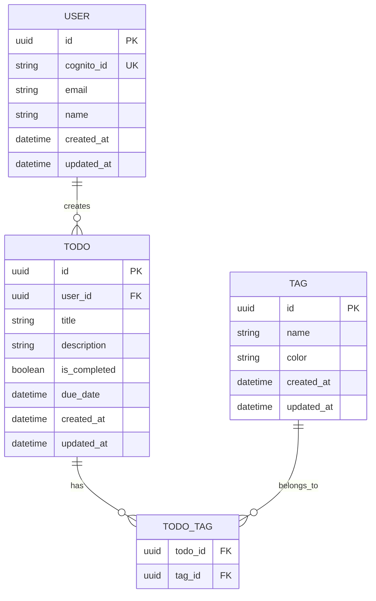
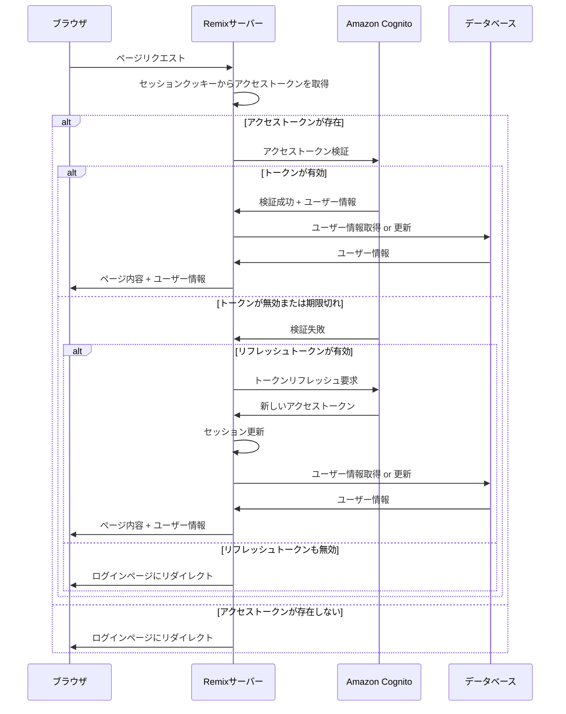

# Todo App

- Remix
- Amazon RDS(PostgresSQL) / Prisma ORM
- Amazon Cognito
- shadcn/ui

## 開発開始

```shell
# データベースサーバーの起動
docker compose up -d
# Nodeモジュールのインストール
npm install
# Remixの開発開始
npm run dev
```

## URL 一覧

### 認証関連

- `/login` ログインページ
- `/signup` 新規ユーザー登録ページ
- `/logout` ログアウト処理
- `/forgot-password` パスワードリセットページ

### Todo 管理

- `/` ダッシュボード

### ユーザー設定

- `/profile` ユーザープロフィール

## ER 図



## 認証フロー


