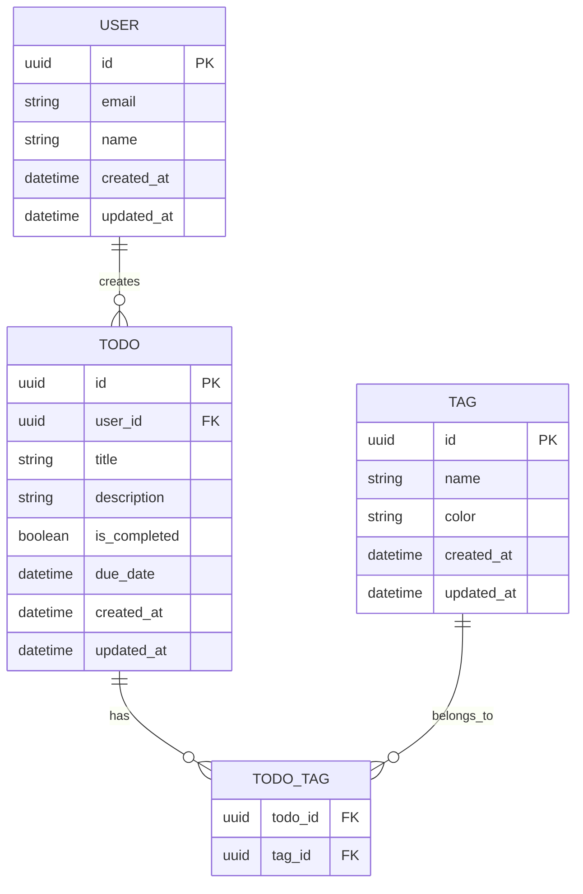

# Todo App

- Remix
- Amazon RDS(PostgresSQL) / Prisma ORM
- Amazon Cognito
- shadcn/ui

## 開発開始

```shell
# データベースサーバーの起動
docker compose up -d
# Nodeモジュールのインストール
npm install
# Remixの開発開始
npm run dev
```

## ER 図


